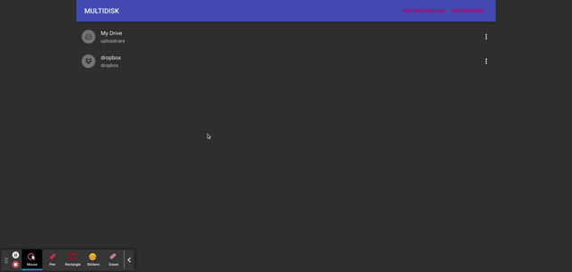

> TL;DR you can find code at https://github.com/sergeyt/multidisk



I am going to show you how to relatively quickly build a small Google Drive app or kind of that. I know "Google Drive" may sound a bit provocative, but it is done just to raise some chunk of your attention :smile:. Also believe me or not but I've done the app within few mornings (yep I am morning person :smile:). Below is some details about what I've done and how.

## High level idea

The idea is simple. I'd like to build a unified UI for all my drives. For sake of simplicity I selected only few platforms as a starting point:
- [Uploadcare](https://uploadcare.com) - nice and quite new one with simple APIs and have free plan
- [Dropbox](https://www.dropbox.com/) - I assume no need any introduction

Lets call it MultiDisk, it is like https://www.odrive.com/, but built for the Web using quite modern tech stack.
## What I've done so far

In terms of features the app includes the following capabilities:
- Allow managing multiple drives
- Uploading, downloading and deleting files
- At this point I've implemented drives for *Uploadcare* and *Dropbox*, but I'd like to add support for Google Drive, etc. Especially if the app gains some attention

You can just briefly watch [this short video](https://youtu.be/W4cYjoFQaXg) to have more vision about the features mentioned above.

## Tooling

To build the app I've chosen the following tools:

- [TypeScript](https://www.typescriptlang.org/) - I prefer having types from the start of any project nowadays. The reason for this could be discussed separately :smile:. Maybe just because I started typed programming first
- [Uploadcare](https://uploadcare.com) - new one for me, lets learn something new together
- [Next.js](https://nextjs.org/) - no need any introduction as well
- [Material UI](https://material-ui.com/) - good React framework with plenty of components. Maybe later I'll refactor the app to use [Chakra UI](https://chakra-ui.com/) since it looking promising to me too

All tools are well known to me except Uploadcare and Dropbox APIs. Great, it is a learning opportunity then.
## How I've done this

My steps were:
- Project bootstrapping
- Drive abstraction
- Uploadcare Drive implementation
- Dropbox Drive implementation
- Few UI pages

That is it. Lets dive in and cover each step with some additional text.
### Project bootstrapping

According to [this Next.js doc](https://nextjs.org/docs/getting-started) it is easy peasy as just running `npx create-next-app` command in your shell and you are literally done :smile:

### Drive interfaces

It is time for pumping this post with some code :smile:. I've come up with the following interfaces to abstract any drive and its objects. These abstractions are needed to unify different storage providers.

```typescript
export type ItemType = "file" | "folder";

export interface Item {
  type: ItemType;
  id: string;
  name: string;
  path: string;
  driveId: string;
}

export interface File extends Item {
  size: number;
  createdAt: Date;
  url?: string;
  download?: () => Promise<any>;
}

export interface Drive {
  options: any;
  provider: string;

  getItems(folderId?: string): Promise<Item[]>;
  deleteFile(fileId: string): Promise<void>;
  deleteFolder(folderId: string): Promise<void>;
}
```

### Implementation of UploadcareDrive

The API docs of Uploadcare can be found at https://uploadcare.com/api-refs/rest-api/v0.5.0/.

We will just use [axios](https://github.com/axios/axios) to make HTTP requests and I did not find any typed client for my needs. I happy to do a small NPM package for Uploadcare API client. I know about [this one](https://github.com/uploadcare/uploadcare-upload-client), but currently it is more focussed on uploading and downloading files and it does not cover all features of Uploadcare API. Maybe just need to request it on github :smile:

```typescript
import axios from "axios";
import { Drive, File, Item } from "../types";
import { checkResponseOK } from "./utils";

type Options = {
  type: string;
  id: string;
  name: string;
  publicKey: string;
  secretKey: string;
};

export default class UploadcareDrive implements Drive {
  private _options: Options;

  constructor(options: Options) {
    this._options = options;
  }

  get options(): Options {
    return this._options;
  }

  get provider() {
    return this.options.type;
  }

  get id() {
    return this.options.id;
  }

  get name() {
    return this.options.name;
  }

  axios() {
    return axios.create({
      headers: {
        Accept: "application/vnd.uploadcare-v0.5+json",
        Authorization: `Uploadcare.Simple ${this.options.publicKey}:${this.options.secretKey}`,
      },
    });
  }

  async getItems(folderId?: string): Promise<Item[]> {
    const resp = await this.axios().get("https://api.uploadcare.com/files/");
    checkResponseOK(resp);
    return resp.data.results.map(
      (f) =>
        ({
          type: "file",
          driveId: this.id,
          id: f.uuid,
          name: f.original_filename,
          createdAt: new Date(f.datetime_uploaded),
          url: f.original_file_url,
          size: f.size,
        } as File)
    );
  }

  async deleteFile(fileId: string): Promise<void> {
    const resp = await this.axios().delete(
      `https://api.uploadcare.com/files/${fileId}/`
    );
    checkResponseOK(resp);
  }

  deleteFolder(folderId: string): Promise<void> {
    return Promise.resolve(undefined);
  }
}
```

### Implementation of DropboxDrive

Dropbox has [a wonderful docs](https://www.dropbox.com/developers/documentation) with even [interactive playground](https://dropbox.github.io/dropbox-api-v2-explorer/) called API explorer. I've implemented the version of *DropboxDrive* that used short-lived token without refreshing token capability. Sorry about that, maybe next time I'll find a time to revise that.

Here a code of current version:

```typescript
import axios from "axios";
import trimStart from "lodash/trimStart";
import { Drive, Item, File } from "../types";
import { checkResponseOK, downloadBlob, trimPrefix } from "./utils";

type Options = {
  type: string;
  id: string;
  name: string;
  accessToken: string;
};

export default class DropboxDrive implements Drive {
  private _options: Options;

  constructor(options: Options) {
    this._options = options;
  }

  get provider() {
    return "dropbox";
  }
  get id() {
    return this.options.id;
  }
  get name() {
    return this.options.name;
  }
  get options() {
    return this._options;
  }

  async getItems(folderId: string = ""): Promise<Item[]> {
    if (!folderId.startsWith("/")) {
      folderId = "/" + folderId;
    }
    const resp = await this.axios().post(
      "https://api.dropboxapi.com/2/files/list_folder",
      {
        path: folderId === "/" ? "" : folderId,
      }
    );
    checkResponseOK(resp);
    return resp.data.entries.map((entry) => {
      if (entry[".tag"] === "file") {
        return {
          type: "file",
          id: trimPrefix(entry.id, "id:"),
          name: entry.name,
          path: entry.path_display,
          createdAt: new Date(entry.server_modified),
          driveId: this.id,
          size: entry.size,
          download: async () => {
            const resp = await this.axios().post(
              "https://content.dropboxapi.com/2/files/download",
              undefined,
              {
                headers: {
                  "Dropbox-API-Arg": JSON.stringify({ path: entry.id }),
                },
                responseType: "blob",
              }
            );
            downloadBlob(resp.data, entry.name);
          },
        } as File;
      }
      return {
        type: "folder",
        id: trimStart(entry.path_display, "/"),
        name: entry.name,
        path: entry.path_display,
        driveId: this.id,
      } as Item;
    });
  }

  async deleteFile(fileId: string): Promise<void> {
    const resp = this.axios().post(
      "https://api.dropboxapi.com/2/file_requests/delete",
      {
        ids: [fileId],
      }
    );
    checkResponseOK(resp);
  }

  deleteFolder(folderId: string): Promise<void> {
    return Promise.resolve(undefined);
  }

  axios() {
    return axios.create({
      headers: {
        Authorization: `Bearer ${this.options.accessToken}`,
        "Content-Type": "application/json",
      },
    });
  }
}
```

### Application UI

MVP version of the app has only few pages and few dialogs:
- Home page with list of drives
- Drive detail page with list of files
- New drive dialog
- Confirmation dialog for delete actions

### Home Page

We will use [SWR](https://nextjs.org/docs/basic-features/data-fetching#swr) for data fetching recommended by Next.js folks. The home has straightforward implementation. Here a full script of the Home Page:

```typescript
import isEmpty from "lodash/isEmpty";
import useSWR from "swr";
import { getDrives } from "../core/store";
import Loader from "../components/Loader";
import Placeholder from "../components/Placeholder";
import DriveList from "../components/DriveList";

export default function Home() {
  const { data: drives } = useSWR("/drives", getDrives);
  if (!drives) {
    return <Loader />;
  }

  if (isEmpty(drives)) {
    return (
      <Placeholder>
        You don't any drives, but you can create one clicking on ADD DRIVE
        button
      </Placeholder>
    );
  }

  return <DriveList drives={drives} />;
}
```

Where *DriveList* component is coded as follow:

```typescript
import Link from "next/link";
import ListItem from "@material-ui/core/ListItem";
import ListItemAvatar from "@material-ui/core/ListItemAvatar";
import Avatar from "@material-ui/core/Avatar";
import { SiDropbox as DropboxIcon } from "react-icons/si";
import { FiHardDrive as DriveIcon } from "react-icons/fi";
import ListItemText from "@material-ui/core/ListItemText";
import ListItemSecondaryAction from "@material-ui/core/ListItemSecondaryAction";
import List from "@material-ui/core/List";
import { Drive } from "../types";
import DriveMenu from "./DriveMenu";

export default function DriveList({ drives }: { drives: Drive[] }) {
  const items = drives.map((d, k) => (
    <Link href={`/drive/${d.id}`} key={k}>
      <ListItem style={{ cursor: "pointer" }}>
        <ListItemAvatar>
          <Avatar>
            <Icon type={d.provider} />
          </Avatar>
        </ListItemAvatar>
        <ListItemText primary={d.name} secondary={d.provider} />
        <ListItemSecondaryAction>
          <DriveMenu driveId={d.id} />
        </ListItemSecondaryAction>
      </ListItem>
    </Link>
  ));
  return <List>{items}</List>;
}

const Icon = ({ type }) => {
  switch (type) {
    case "dropbox":
      return <DropboxIcon />;
    default:
      return <DriveIcon />;
  }
};
```

### Drive View page

Also it is simple as it is:

```typescript
import { useRouter } from "next/router";
import useSWR from "swr";
import { Box } from "@material-ui/core";
import { getDrive } from "../../core/store";
import Loader from "../../components/Loader";
import ItemList from "../../components/ItemList";
import Uploader from "../../components/Uploader";

export default function DriveView() {
  const router = useRouter();
  const { driveId, folder: folderId } = router.query;

  const key = folderId
    ? `/drive/${driveId}?folder=${encodeURIComponent(String(folderId))}`
    : `/drive/${driveId}`;
  const { data } = useSWR(key, async () => {
    const drive = await getDrive(String(driveId));
    const items = await drive.getItems(folderId ? String(folderId) : "");
    return { drive, items };
  });
  if (!data) {
    return <Loader />;
  }

  return (
    <>
      <Box m={2} mb={2}>
        <Uploader drive={data.drive} />
      </Box>
      <ItemList data={data.items} />
    </>
  );
}
```

Where *Uploader* component is coded as:

```typescript
import { mutate } from "swr";
import { Widget } from "@uploadcare/react-widget";
import { Drive } from "../types";

export default function Uploader({ drive }: { drive: Drive }) {
  if (drive.provider === "uploadcare") {
    return (
      <>
        <label>Upload a file:&nbsp;</label>
        <Widget
          publicKey={drive.options.publicKey}
          onChange={() => {
            mutate(`/drive/${drive.id}`);
          }}
        />
      </>
    );
  }
  return null;
}
```

And *ItemList* component is implemented as:

```typescript
import isEmpty from "lodash/isEmpty";
import List from "@material-ui/core/List";
import { Item, File } from "../types";
import FileItem from "./FileItem";
import FolderItem from "./FolderItem";
import Placeholder from "./Placeholder";

export default function ItemList({ data }: { data: Item[] }) {
  if (isEmpty(data)) {
    return (
      <Placeholder>
        This drive is empty, but you can fill it out with something :)
      </Placeholder>
    );
  }

  const items = data.map((item, k) => {
    switch (item.type) {
      case "file":
        return <FileItem key={k} item={item as File} />;
      case "folder":
        return <FolderItem key={k} item={item as Item} />;
      default:
        return null;
    }
  });
  return <List>{items}</List>;
}
```

As you might noticed uploading file is implemented just using [Uploadcare](https://uploadcare.com/docs/integrations/react/#react-file-uploader) widget - another big time saver which is nice.

## How I've done Dialogs?

Do you really wanna read the code for dialogs? It should be boring. And maybe it should be enough for this blog post :smile:

Anyway you can be gone to [the github repo](https://github.com/sergeyt/multidisk) and have some fun consuming additional bits of information :smile:

## Next Steps

Next time probably I'll try adding more features in the application like:

- Google Drive
- AWS S3 Drive
- Framework-agnostic File Manager web component. Maybe using [Angular elements](https://angular.io/guide/elements)
- Folders
- Just improving UX like making wizard to create a drive
- Better authorization, maybe making official Dropbox or Google apps
- Storing drive connections in Mongo Cloud to persist config across different devices (maybe paid feature :smile:)


Enjoy! EOF :smile:
