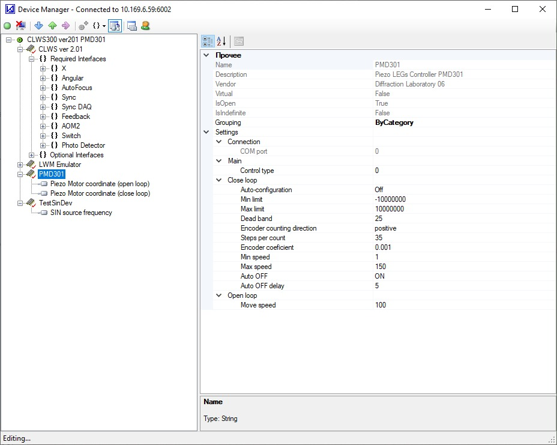
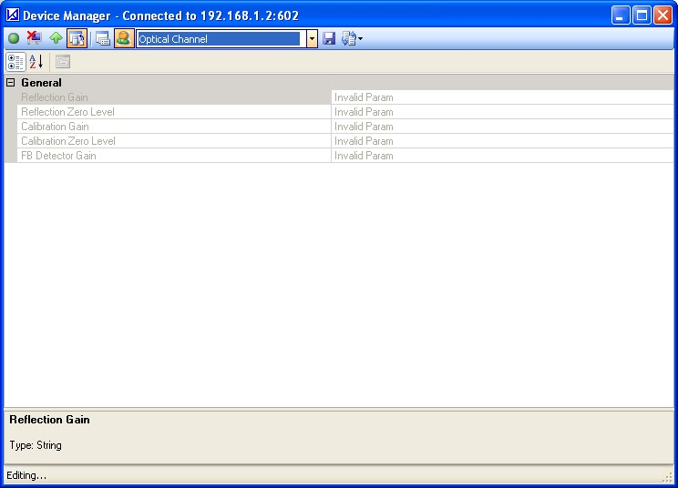

## What is it?

Device Manager is a set of software components that helps to abstract devices for [Circle Laser Writing System](/clws).
I was doing this project in laboratory of diffractive optics at [IA&E SB RAS](https://www.iae.nsk.su/en/) as part of my education at [NSU](https://www.nsu.ru/).
I have fantastic time here learning system-level programming and I produced amazing work that is still used.
Most of user interfaces I implemented are used without major changes.

## Architecture

Device Manager consists from:
* SDK to implement devices in C++
* Core module that loads device libraries and manages their configurations
* TCP server with custom command-based protocol for remote control and configuration
* UI client implemented in C#

## Features

Device Manager is very useful :)
* It allows multiple configurations of virtual devices (aka virtual machines). The whole [CLWS](/clws) is represented as single virtual device with multiple device interfaces that can be linked to interfaces of real or software-emulated devices
* It can load and apply configurations at runtime without recompiling control program

## Device Manager Screenshots

