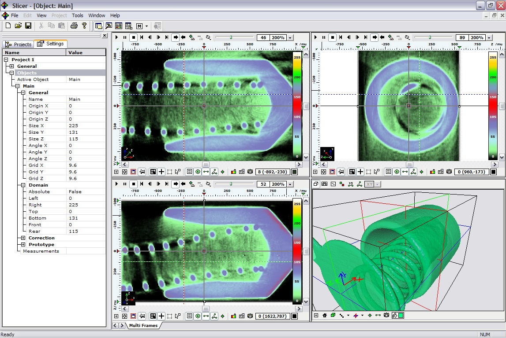
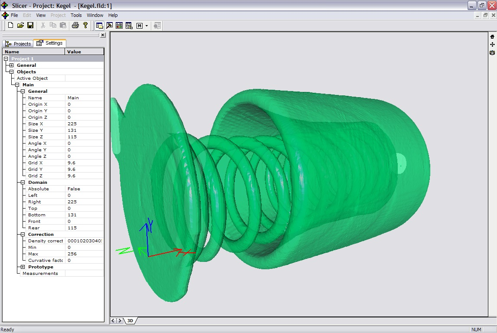
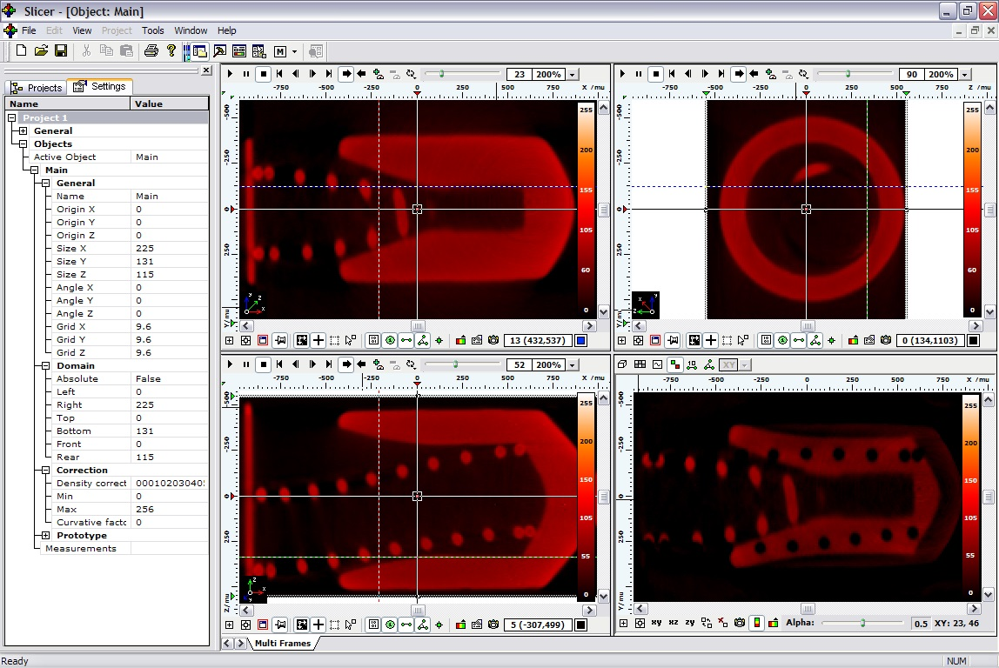

## What is it?

It is tomography analysis software implemented during my education at [NSU](https://www.nsu.ru/).

## Implementation details

Implemented using:
- C++
- Microsoft Foundation Classes
- OpenGL

## Screenshots

